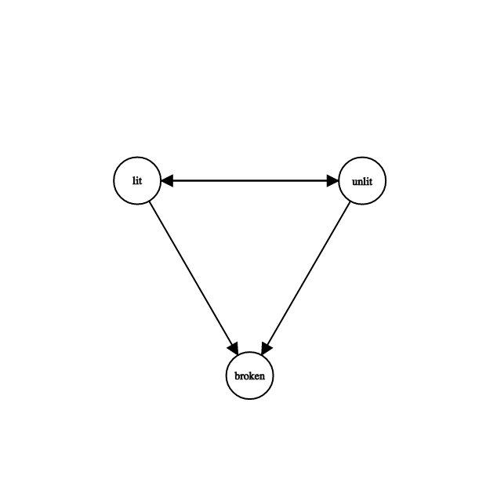

# Workshop - Section 1
## A Journey of Discovery

What if we didn't have "state", and things were just always what they were? That would be a bit of a strange world. Thinking about that too much might hurt your brain. But, let's consider an absurd example anyways, a light bulb.

If we had a lamp in this stateless world, in order for the lamp to be on, we would give it a light bulb that was always lit, and when we needed it off, we would give it a lightbulb that was always unlit (or no bulb at all, but roll with me here).

We can represent these stateless bulbs as functions that always return the same value. You can see what those look like in `stateless-light-bulb.js`.

---

Our stateless bulbs are a bit absurd, but they help us understand something about state, it's most useful when we can change it.

"State" is the representation of a system at a particular point in time, in the case of the light bulb, our states are a "lit" state and an "unlit" state.

Let's write a function that returns us a working light bulb. You can see what that looks like in `working-light-bulb.js`.

---

We made a working light bulb, but it's actually an inaccurate one. Light bulbs,
at least up until recently, were pretty easy to break. Thus, we need a bulb
that can be broken.

Let's try and write a function that represents this. You can see that in `more-accurate-bulb.js`.

---

Now, we've run into a problem, an impossible state has occured with our light bulb where it is both lit and broken. I want you to take a few minutes and try and solve our `moreAccurateBulb` function to keep us from getting into impossible states.

---

Let's work through some adjustments to `moreAccurateBulb` until we have a slightly better bulb

---

Why was this challenging? This tweet contains some of the answer: [https://twitter.com/DavidKPiano/status/1178253041063137280?s=20](https://twitter.com/DavidKPiano/status/1178253041063137280?s=20).

> The simplest state machine is a boolean variable. The most complex state machine is multiple boolean variables.

David likes to make jokes, but this joke is pretty accurate, too. Doing some math explains to us why.

Every boolean represents two states. For every boolean we add, we double the amount of states in the machine.

- 1 boolean = 2 states
- 2 booleans = 4 states
- 3 booleans = 8 states
- 4 booleans = 16 states

Boolean state complexity increases by 2^^n where _n_ equals the number of booleans you have.

But does our light bulb _really_ have 4 states? No, it really has only three. We know that `(isLit && isBroken) === true` is an _impossible_ state.

| isLit: true, isBroken: false | isLit: false, isBroken: false |
| ---------------------------- | ----------------------------- |
| isLit: true, isBroken: true  | isLit: false, isBroken: true  |

That bottom-left "state" is impossible. What if we found a way to enumerate only the _possible_ states?

---

Our `betterBulb` is built by changing our mind from controlling pieces of state to representing our enumerated states atomically. We can do this with an object that maps out our possible states. We then design our function so that it can only return one of these three states and cannot get into an impossible one.
You can see the solution in `better-bulb.js`

It's worth pointing out that we've made a distinctly different data structure for our "state" with this function. For starters, we only have our three states, `lit`, `unlit`, and `broken`. We've also made it clear that there are a finite number of ways we can move from one state to another. Look through the code and take a minute to define these transitions.

We can do the following:
* `lit -> unlit`
* `unlit -> lit`
* `lit -> broken`
* `unlit -> broken`

That's it! We only have four possible transitions. So we have a distinct set of states, and a distinct set of transitions between those states, does anyone know what data structure we have?

We have a graph! A directed graph, specifically

For those of you who might not know what a graph is (and haven't checked out my Data Structures and Algorithms course yet), a graph is a data structure made up of "nodes" linked to each other by "edges". In the case of our states, each state is a node, and each transition represents an "edge" between our nodes. We have a graph that looks like this:

I want this image and concept firmly planted in our minds as we continue this workshop, as learning to think of state in this way will not only help state machines make more sense, but help you write more robust programs as well.
